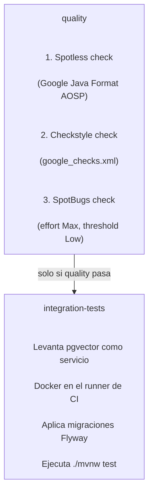

<div align="center">


# FinanzIA — Backend

API REST de datos · Autenticación · Embeddings · RAG · Email

Única capa del sistema con acceso directo a la base de datos.

</div>

---

## Responsabilidad

Este repositorio implementa toda la lógica de persistencia, seguridad y búsqueda semántica de FinanzIA. Es la única capa del sistema con acceso directo a PostgreSQL. El frontend y el agente de IA consumen esta API REST, nunca la base de datos directamente.

Sus responsabilidades concretas son:

- **Persistencia:** CRUD completo de todas las entidades del dominio vía JPA/Hibernate.
- **Autenticación:** emisión y validación de JWT con encriptación RSA-2048 en tránsito y HMAC-SHA256 en reposo.
- **Embeddings:** generación automática de vectores semánticos al crear o actualizar transacciones vía Spring AI + OpenAI.
- **RAG:** búsqueda de similitud coseno sobre embeddings filtrada por usuario vía pgvector.
- **Email:** recuperación de contraseña con tokens de un solo uso vía Resend API.

> Lo que este repositorio no hace: orquestación de agentes IA, lógica conversacional, streaming de respuestas, ni acceso directo desde el navegador.

---

## Stack tecnológico

| Componente | Tecnología | Versión |
|---|---|---|
| Lenguaje | Java | 21 |
| Framework | Spring Boot | 4.x |
| ORM | Spring Data JPA / Hibernate | — |
| Base de datos | PostgreSQL + pgvector | 16 |
| Migraciones | Flyway | — |
| Autenticación | Spring Security + JWT (jjwt) | 0.12.6 |
| Encriptación en tránsito | RSA-2048 efímero por startup | — |
| Encriptación en reposo | HMAC-SHA256 (email) + BCrypt (password) | — |
| IA / Embeddings | Spring AI + OpenAI text-embedding-3-small | 2.0.0-M3 |
| Vector store | pgvector vía Spring AI | — |
| Email transaccional | Resend API vía `java.net.http.HttpClient` | — |
| Build | Maven Wrapper | — |
| Formato | Spotless — Google Java Format AOSP | 2.43.0 |
| Linting estático | Checkstyle (`google_checks.xml`) + SpotBugs | 3.6.0 / 4.9.8 |

---

## Inicio rápido

### Prerrequisitos

- Java 21.
- Docker Desktop, para levantar PostgreSQL + pgvector localmente.

### Configuración local

```bash
# 1. Clonar el repositorio
git clone https://github.com/Proyecto-final-4/backend.git
cd backend

# 2. Configurar variables de entorno
cp .env.example .env

# Editar .env y completar al menos:
# SPRING_AI_OPENAI_API_KEY=sk-...
# RESEND_API_KEY=re_...

# 3. Levantar PostgreSQL 16 con extensión pgvector
docker compose up -d

# 4. Iniciar la aplicación
# Flyway aplica todas las migraciones automáticamente al arrancar
./mvnw spring-boot:run          # Linux / macOS
.\mvnw.cmd spring-boot:run      # Windows PowerShell
```

El servidor queda disponible en:

```text
http://localhost:8080
```

La documentación de los endpoints está en esta misma guía. No hay Swagger configurado en el MVP.

### Activar git hooks locales

```bash
git config core.hooksPath .githooks
```

Activa dos hooks:

- **pre-commit:** ejecuta formatter y linter, y bloquea si detecta claves de OpenAI en los cambios staged.
- **commit-msg:** valida que el mensaje siga el formato Conventional Commits.

---

## Comandos de desarrollo

```bash
# Formatear todo el código automáticamente
./mvnw spotless:apply

# Quality gate completo — idéntico al que corre en CI
./mvnw -DskipTests spotless:check checkstyle:check spotbugs:check

# Correr tests de integración
# Requiere pgvector corriendo vía Docker
./mvnw test

# Build completo con quality gate + tests
./mvnw verify
```

En Windows PowerShell usar `.\mvnw.cmd` en lugar de `./mvnw`.

---

## Estructura del proyecto

```text
src/
├── main/
│   ├── java/com/backend/backend/
│   │   │
│   │   ├── domain/
│   │   │   └── user/                              # Dominio de usuario y autenticación
│   │   │       ├── AuthController.java            # Endpoints: /auth/** y /users/me
│   │   │       ├── AuthService.java               # Registro, login, validación de credenciales
│   │   │       ├── PasswordResetService.java      # Flujo forgot/reset vía Resend API
│   │   │       ├── User.java                      # Entidad JPA — tabla users
│   │   │       ├── UserRepository.java            # findByEmailHmac para lookup seguro sin exponer email
│   │   │       ├── PasswordResetToken.java        # Entidad JPA — tabla password_reset_tokens
│   │   │       ├── PasswordResetTokenRepository.java
│   │   │       ├── EmailAlreadyRegisteredException.java   # HTTP 409 Conflict
│   │   │       ├── AuthResponse.java              # { token, id, name, email }
│   │   │       ├── RegisterRequest.java           # DTO interno post-desencriptado con @Valid
│   │   │       ├── EncryptedRegisterRequest.java  # DTO externo con campos RSA + @NotBlank
│   │   │       ├── LoginRequest.java
│   │   │       ├── EncryptedLoginRequest.java
│   │   │       ├── ForgotPasswordRequest.java     # { email } con @NotBlank @Email
│   │   │       └── ResetPasswordRequest.java      # { token, newPassword } con @Size(min=8)
│   │   │
│   │   ├── shared/
│   │   │   ├── crypto/
│   │   │   │   ├── RsaKeyService.java             # Genera par RSA-2048 en startup y expone clave pública
│   │   │   │   └── EncryptionService.java         # hmac(String) para email en reposo
│   │   │   ├── BaseEntity.java                    # UUID PK autogenerado + created_at + updated_at
│   │   │   └── GlobalExceptionHandler.java        # RuntimeException→400 · EmailAlreadyRegistered→409
│   │   │
│   │   └── BackendApplication.java
│   │
│   └── resources/
│       ├── db/migration/                          # Migraciones Flyway — V1 a V7
│       └── application.properties                 # Configuración del servidor y Spring AI
│
└── test/
    └── java/com/backend/backend/                  # Tests de integración con pgvector real
```

---

## API REST — Referencia completa

Header de autenticación requerido en todos los endpoints, excepto `/health` y `/auth/**`:

```http
Authorization: Bearer <jwt_token>
```

Formato de error estándar:

```json
{
  "error": "mensaje descriptivo del problema"
}
```

---

## Health check

### GET `/health`

Verifica que el servidor está activo. No requiere autenticación. Usado por Railway para health checks.

#### Response `200 OK`

```json
{
  "status": "UP",
  "timestamp": "2025-06-15T13:00:00Z"
}
```

---

## Autenticación — `/auth`

### GET `/auth/public-key`

Devuelve la clave pública RSA-2048 en formato SPKI/Base64. El cliente debe usarla para encriptar las credenciales antes de cualquier llamada a `/auth/register` o `/auth/login`.

La clave es efímera: se regenera en cada startup del servidor. Esto significa que el cliente debe obtener una clave fresca en cada sesión de autenticación.

#### Response `200 OK`

```json
{
  "publicKey": "MIIBIjANBgkqhkiG9w0BAQEFAAOCAQ8A..."
}
```

### POST `/auth/register`

Crea una cuenta nueva. Los tres campos deben venir encriptados con la clave RSA pública obtenida previamente. El backend desencripta con su clave privada, valida los datos, hashea la contraseña y persiste el usuario.

#### Request

```json
{
  "encryptedName": "<rsa_ciphertext>",
  "encryptedEmail": "<rsa_ciphertext>",
  "encryptedPassword": "<rsa_ciphertext>"
}
```

#### Response `201 Created`

```json
{
  "token": "<jwt_bearer_token>",
  "id": "550e8400-e29b-41d4-a716-446655440000",
  "name": "Juan Pérez",
  "email": "juan@example.com"
}
```

#### Errores

- `400 Bad Request`: algún campo está vacío, el email no es válido o la contraseña tiene menos de 8 caracteres.
- `409 Conflict`: el email ya está registrado en el sistema.

### POST `/auth/login`

Inicia sesión. Los campos también viajan encriptados con RSA.

#### Request

```json
{
  "encryptedEmail": "<rsa_ciphertext>",
  "encryptedPassword": "<rsa_ciphertext>"
}
```

#### Response `200 OK`

```json
{
  "token": "<jwt_bearer_token>",
  "id": "550e8400-e29b-41d4-a716-446655440000",
  "name": "Juan Pérez",
  "email": "juan@example.com"
}
```

#### Errores

- `400 Bad Request`: credenciales inválidas o email no registrado.

### POST `/auth/forgot-password`

Solicita recuperación de contraseña. Siempre devuelve `200 OK` independientemente de si el email existe. Esto se hace por diseño deliberado para no revelar qué emails están registrados en el sistema y prevenir enumeración de usuarios.

Si el email existe, se genera un token UUID, se persiste con expiración de 1 hora y se envía un email vía Resend con el enlace de restablecimiento.

#### Request

```json
{
  "email": "juan@example.com"
}
```

#### Response `200 OK`

Sin body.

### POST `/auth/reset-password`

Restablece la contraseña usando el token recibido por email.

#### Request

```json
{
  "token": "a1b2c3d4-e5f6-7890-abcd-ef1234567890",
  "newPassword": "nuevaContraseña123"
}
```

#### Response `200 OK`

Sin body.

#### Errores

- `400 Bad Request`: el token no existe, ya fue usado anteriormente o expiró hace más de 1 hora.

---

## Perfil de usuario — `/users`

### GET `/users/me`

#### Response `200 OK`

```json
{
  "id": "550e8400-e29b-41d4-a716-446655440000",
  "name": "Juan Pérez",
  "email": "juan@example.com",
  "createdAt": "2025-01-01T00:00:00Z"
}
```

### PUT `/users/me`

Todos los campos son opcionales. Para cambiar contraseña se requieren ambos campos de password simultáneamente.

#### Request

```json
{
  "name": "Juan A. Pérez",
  "currentPassword": "contraseñaActual",
  "newPassword": "nuevaContraseña123"
}
```

#### Response `200 OK`

Devuelve el perfil actualizado.

---

## Categorías — `/categories`

### GET `/categories`

Devuelve todas las categorías disponibles para el usuario: las 12 del sistema (`isSystem: true`) más las personalizadas del usuario autenticado.

#### Response `200 OK`

```json
[
  {
    "id": "uuid",
    "name": "Alimentación",
    "type": "EXPENSE",
    "color": "#FF5733",
    "icon": "utensils",
    "isSystem": true,
    "parentId": null
  }
]
```

### Categorías del sistema

| Tipo | Categorías |
|---|---|
| EXPENSE | Alimentación · Transporte · Salud · Vivienda · Entretenimiento · Educación · Ropa · Otros gastos |
| INCOME | Salario · Freelance · Inversiones · Otros ingresos |

### POST `/categories`

Crea una categoría personalizada para el usuario autenticado. `color`, `icon` y `parentId` son opcionales.

#### Request

```json
{
  "name": "Gimnasio",
  "type": "EXPENSE",
  "color": "#4CAF50",
  "icon": "dumbbell",
  "parentId": null
}
```

#### Response `201 Created`

Devuelve la categoría creada.

### PUT `/categories/{id}`

Mismo body que `POST`. Solo permite editar categorías propias del usuario. No permite editar categorías del sistema.

### DELETE `/categories/{id}`

Solo permite eliminar categorías propias. Falla con `400 Bad Request` si la categoría tiene transacciones asociadas.

#### Response `204 No Content`

Sin body.

---

## Transacciones — `/transactions`

### GET `/transactions`

Lista las transacciones del usuario autenticado con paginación y filtros opcionales.

#### Query params disponibles

| Parámetro | Tipo | Default | Descripción |
|---|---|---:|---|
| `type` | `INCOME \| EXPENSE` | — | Filtrar por tipo de movimiento |
| `categoryId` | `UUID` | — | Filtrar por categoría específica |
| `from` | `YYYY-MM-DD` | — | Inicio del rango de fechas |
| `to` | `YYYY-MM-DD` | — | Fin del rango de fechas |
| `page` | Integer, base 0 | 0 | Número de página |
| `size` | Integer | 20 | Ítems por página |

#### Response `200 OK`

```json
{
  "content": [
    {
      "id": "uuid",
      "categoryId": "uuid",
      "categoryName": "Alimentación",
      "amount": "25.50",
      "type": "EXPENSE",
      "transactionDate": "2025-06-15",
      "description": "Almuerzo con el equipo",
      "notes": "Restaurante La Plaza",
      "createdAt": "2025-06-15T13:00:00Z"
    }
  ],
  "totalElements": 100,
  "totalPages": 5,
  "size": 20,
  "number": 0
}
```

### GET `/transactions/{id}`

Detalle de una transacción. Falla con `404 Not Found` si no existe o no pertenece al usuario autenticado.

### POST `/transactions`

Crea una nueva transacción. El backend genera el embedding vectorial del campo `description` automáticamente vía Spring AI + OpenAI antes de persistir. `notes` es opcional.

#### Request

```json
{
  "categoryId": "uuid",
  "amount": "25.50",
  "type": "EXPENSE",
  "transactionDate": "2025-06-15",
  "description": "Almuerzo con el equipo",
  "notes": "Restaurante La Plaza"
}
```

#### Response `201 Created`

Devuelve la transacción creada.

### PUT `/transactions/{id}`

Mismo body que `POST`. Si cambia el campo `description`, el embedding se regenera automáticamente.

### DELETE `/transactions/{id}`

#### Response `204 No Content`

Sin body.

---

## Resumen financiero — `/summary`

### GET `/summary`

Calcula el balance, los totales de ingreso y gasto, y el desglose por categoría para el período especificado. Sin parámetros usa el mes calendario actual.

Query params: `from` y `to` en formato `YYYY-MM-DD`.

#### Response `200 OK`

```json
{
  "totalIncome": "1500.00",
  "totalExpense": "900.00",
  "balance": "600.00",
  "byCategory": [
    {
      "categoryId": "uuid",
      "categoryName": "Alimentación",
      "total": "300.00"
    },
    {
      "categoryId": "uuid",
      "categoryName": "Transporte",
      "total": "150.00"
    }
  ]
}
```

---

## RAG — Búsqueda semántica — `/rag`

### POST `/rag/search`

Busca transacciones del usuario autenticado por similitud semántica sobre sus embeddings vectoriales. La búsqueda ejecuta similitud coseno en pgvector filtrada estrictamente por `user_id`: cada usuario solo accede a su propio historial.

#### Request

```json
{
  "query": "gastos en café o bebidas",
  "limit": 5
}
```

#### Response `200 OK`

```json
[
  {
    "id": "uuid",
    "description": "Café en Starbucks",
    "notes": null,
    "amount": "5.00",
    "type": "EXPENSE",
    "transactionDate": "2025-06-10",
    "categoryName": "Alimentación"
  }
]
```

El campo `query` se convierte a embedding 1536d vía OpenAI en tiempo real y se compara contra los vectores almacenados. El `limit` controla cuántos resultados más similares se devuelven.

---

## Modelo de seguridad en profundidad

FinanzIA implementa múltiples capas de seguridad independientes. El compromiso de una capa no compromete las demás.

### Capa 1 — Credenciales en tránsito: RSA-2048 efímero

En cada startup el servidor genera un par de claves RSA-2048 usando `java.security.KeyPairGenerator`. La clave pública se expone vía `GET /auth/public-key`. El cliente la usa para encriptar `name`, `email` y `password` antes de enviarlos, incluso sobre HTTPS.

La clave privada nunca sale del proceso JVM. Al reiniciar el servidor, el par de claves se regenera completamente. Esto hace que un par de claves comprometido sea inútil después de un restart.

### Capa 2 — Email en reposo: HMAC-SHA256

El email de cada usuario se almacena encriptado en la base de datos. Para permitir búsquedas de unicidad, login y recuperación de contraseña, se almacena también el HMAC-SHA256 del email en la columna `email_hmac VARCHAR(64) UNIQUE`.

Un atacante con acceso directo a la base de datos ve solo texto cifrado y HMACs. No puede inferir qué emails están registrados ni realizar búsquedas inversas.

### Capa 3 — Contraseñas: BCrypt

Las contraseñas nunca se almacenan, ni siquiera encriptadas. Se hashean con BCrypt antes de persistir. BCrypt es resistente a ataques de fuerza bruta por diseño, con factor de costo configurable, y nunca produce el mismo hash para la misma entrada.

### Capa 4 — Sesiones: JWT Bearer stateless

Los tokens JWT son stateless. El servidor no mantiene estado de sesión. Cada token está firmado con una clave secreta configurable en `application.properties`. El BFF de Next.js gestiona el token exclusivamente server-side.

### Capa 5 — Recuperación de contraseña: tokens de un solo uso

Los tokens de recuperación tienen tres mecanismos de invalidación:

- Expiración temporal de 1 hora.
- Uso único, con `used = true` al primer uso válido.
- Eliminación en cascada si el usuario es eliminado (`ON DELETE CASCADE`).

Un token usado o expirado devuelve `400 Bad Request` sin información adicional.

### Capa 6 — Pre-commit hooks

El hook `pre-commit` del repositorio escanea los cambios staged en busca de patrones que coincidan con claves de OpenAI (`sk-...`) y bloquea el commit si las detecta, previniendo leaks accidentales en el historial de Git.

---

## Migraciones Flyway

Flyway aplica las migraciones en orden estricto al iniciar la aplicación. El estado de cada migración queda registrado en la tabla `flyway_schema_history`.

| Versión | Archivo | Descripción |
|---|---|---|
| V1 | `V1__create_users_table.sql` | Tabla `users` con id UUID, email, password_hash, name y timestamps |
| V2 | `V2__enable_pgvector.sql` | Habilita la extensión vector en PostgreSQL |
| V3 | `V3__create_categories_table.sql` | Tabla `categories` + seed de 12 categorías del sistema |
| V4 | `V4__create_transactions_table.sql` | Tabla `transactions` con columna `embedding vector(1536)` |
| V5 | `V5__create_budgets_and_goals.sql` | Tablas `budgets` y `savings_goals` |
| V6 | `V6__add_encryption_support.sql` | Migra email a almacenamiento encriptado + columna `email_hmac UNIQUE` |
| V7 | `V7__create_password_reset_tokens.sql` | Tabla `password_reset_tokens` con FK CASCADE + índice en token |

> Nunca modificar una migración ya aplicada en producción. Cualquier cambio estructural requiere una nueva versión `V8`, `V9`, etc.

---

## CI/CD



Ningún merge a `main` es posible si alguno de los dos jobs falla. El deploy en Railway ocurre automáticamente tras CI verde en `main`.

---

## Variables de entorno

| Variable | Requerida | Descripción |
|---|---|---|
| `SPRING_AI_OPENAI_API_KEY` | Sí | Clave de OpenAI para generación de embeddings vectoriales vía Spring AI |
| `RESEND_API_KEY` | Sí | Clave de Resend para envío de emails de recuperación de contraseña |

Consultar `.env.example` para la lista completa incluyendo configuración de base de datos, JWT secret y parámetros del servidor.
